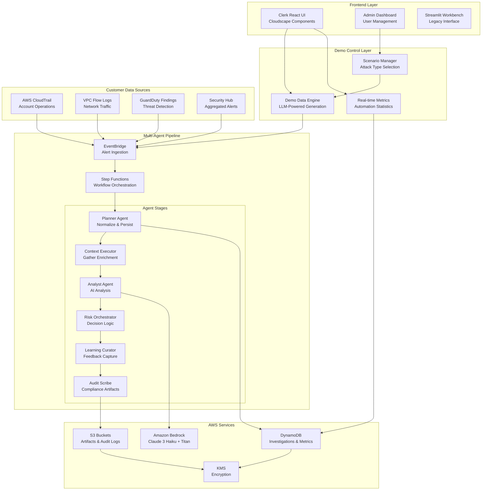
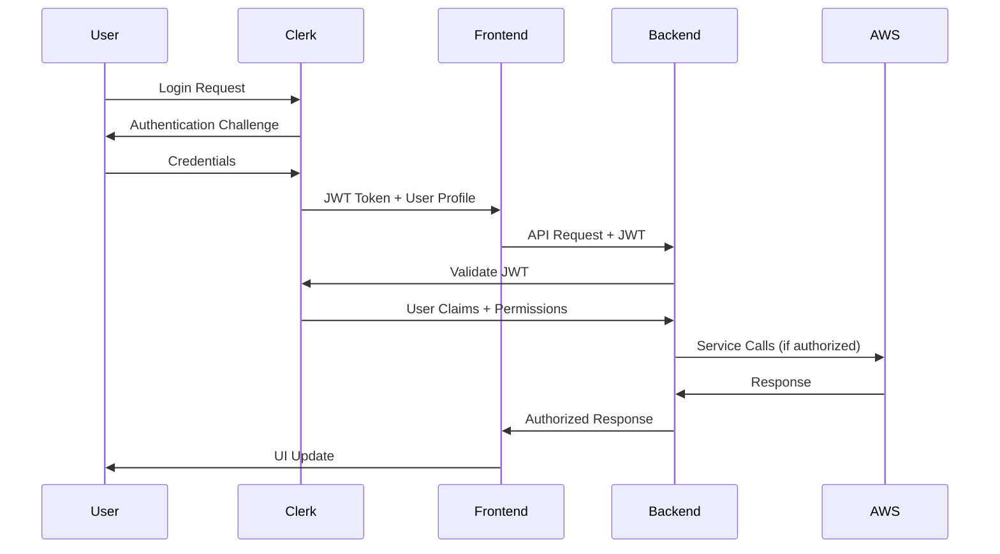

# Design Document

## Overview

The Interactive Demo System transforms NeoHarbour Security into a comprehensive demonstration platform that showcases the multi-agent investigation pipeline's ability to automatically process and close 80%+ of false positive alerts while escalating genuine threats to human analysts. The system integrates seamlessly with existing AWS infrastructure, provides real-time demo data generation, and offers both analyst and administrative interfaces using Clerk authentication and AWS Cloudscape Design System.

The design ensures that demonstrations use actual AWS services (EventBridge, Step Functions, Lambda, DynamoDB, S3, Bedrock) to provide authentic performance characteristics and compliance artifacts, while supporting both synthetic demo scenarios and real customer data ingestion from AWS security services.

## Architecture

### High-Level System Architecture



### Authentication & Authorization Flow



## Components and Interfaces

### 1. Demo Data Engine

**Purpose**: Generate realistic, varied security alerts using LLM-powered content generation

**Key Components**:
- `DemoDataGenerator`: Core engine for creating synthetic alerts
- `ScenarioTemplates`: Pre-defined attack patterns (phishing, ransomware, insider threat, etc.)
- `LLMContentGenerator`: Uses Bedrock to create realistic alert content
- `AlertVariationEngine`: Ensures diversity in generated scenarios

**Interface**:
```python
class DemoDataGenerator:
    def start_continuous_generation(
        self, 
        scenario_types: List[str],
        interval_seconds: float,
        false_positive_rate: float = 0.8
    ) -> str  # Returns generation session ID
    
    def stop_generation(self, session_id: str) -> None
    
    def generate_single_alert(
        self, 
        scenario_type: str,
        risk_level: str = "auto"
    ) -> Dict[str, Any]
```

### 2. Scenario Manager

**Purpose**: Control demo parameters and attack scenario selection

**Key Components**:
- `ScenarioLibrary`: Catalog of available attack scenarios
- `DemoPresets`: Pre-configured demo settings for different audiences
- `ParameterController`: Real-time adjustment of demo parameters

**Interface**:
```python
class ScenarioManager:
    def get_available_scenarios(self) -> List[ScenarioDefinition]
    
    def create_demo_session(
        self,
        preset: str,
        custom_params: Optional[Dict[str, Any]] = None
    ) -> DemoSession
    
    def update_session_parameters(
        self,
        session_id: str,
        parameters: Dict[str, Any]
    ) -> None
```

### 3. Enhanced Multi-Agent Pipeline

**Purpose**: Process both demo and live alerts through the same investigation workflow

**Key Enhancements**:
- **False Positive Detection**: Enhanced logic to automatically identify and close false positives
- **Confidence Scoring**: AI-powered confidence metrics for escalation decisions
- **Real-time Progress Tracking**: Live status updates for demonstration purposes
- **Metrics Collection**: Continuous tracking of automation rates and efficiency

**Enhanced Agent Interfaces**:
```python
class EnhancedAnalystAgent(BaseAgent):
    def analyze_alert(self, context: Dict[str, Any]) -> AnalysisResult:
        # Returns analysis with confidence score and false positive probability
        pass
    
    def should_escalate(self, analysis: AnalysisResult) -> EscalationDecision:
        # Determines if human intervention is required
        pass

class MetricsCollector:
    def record_investigation_outcome(
        self,
        investigation_id: str,
        outcome: str,  # "auto_closed" | "escalated" | "completed"
        confidence: float,
        processing_time: float
    ) -> None
```

### 4. Cloudscape Admin Interface

**Purpose**: Comprehensive system administration using AWS design patterns

**Key Components**:
- `UserManagement`: Clerk user administration with role-based permissions
- `SystemConfiguration`: AWS service setup and validation
- `DemoConfiguration`: Demo parameter management
- `SystemMonitoring`: Real-time health and performance metrics

**Component Structure**:
```typescript
// Admin Dashboard Components
interface AdminDashboard {
  userManagement: UserManagementPanel;
  systemConfig: SystemConfigurationPanel;
  demoConfig: DemoConfigurationPanel;
  monitoring: SystemMonitoringPanel;
}

interface UserManagementPanel {
  userTable: CloudscapeTable<User>;
  roleEditor: RolePermissionEditor;
  auditLog: UserActivityLog;
}
```

### 5. Customer Data Integration Layer

**Purpose**: Seamless ingestion from real AWS security data sources

**Key Components**:
- `CloudTrailConnector`: Processes account operation audit logs
- `VPCFlowConnector`: Analyzes network traffic metadata
- `GuardDutyConnector`: Ingests threat detection findings
- `SecurityHubConnector`: Aggregates multi-service security alerts

**Integration Interface**:
```python
class CustomerDataConnector:
    def configure_data_source(
        self,
        source_type: str,  # "cloudtrail" | "vpcflow" | "guardduty" | "securityhub"
        configuration: DataSourceConfig
    ) -> ConnectionResult
    
    def validate_permissions(
        self,
        source_type: str,
        aws_account_id: str
    ) -> ValidationResult
    
    def start_ingestion(self, source_id: str) -> None
```

## Data Models

### Demo Session Model
```python
@dataclass
class DemoSession:
    session_id: str
    created_at: datetime
    created_by: str
    scenario_types: List[str]
    parameters: DemoParameters
    status: str  # "active" | "paused" | "stopped"
    metrics: DemoMetrics

@dataclass
class DemoParameters:
    interval_seconds: float
    false_positive_rate: float
    complexity_level: str  # "basic" | "intermediate" | "advanced"
    target_audience: str  # "technical" | "executive" | "compliance"
    duration_minutes: Optional[int]
```

### Investigation Enhancement Model
```python
@dataclass
class EnhancedInvestigation:
    # Existing fields
    investigation_id: str
    tenant_id: str
    stage: str
    status: str
    
    # New demo/automation fields
    is_demo: bool
    false_positive_probability: float
    confidence_score: float
    automation_decision: str  # "auto_close" | "escalate" | "monitor"
    processing_time_seconds: float
    demo_session_id: Optional[str]
```

### User Management Model
```python
@dataclass
class User:
    user_id: str
    clerk_id: str
    email: str
    role: UserRole
    permissions: List[Permission]
    created_at: datetime
    last_login: Optional[datetime]
    status: str  # "active" | "inactive" | "suspended"

@dataclass
class UserRole:
    role_name: str  # "admin" | "analyst" | "viewer" | "demo_user"
    permissions: List[str]
    aws_access_level: str  # "full" | "read_only" | "demo_only"
```

### Customer Data Source Model
```python
@dataclass
class DataSourceConfiguration:
    source_id: str
    source_type: str
    aws_account_id: str
    region: str
    configuration: Dict[str, Any]
    status: str  # "active" | "inactive" | "error"
    last_sync: Optional[datetime]
    error_message: Optional[str]
```

## Error Handling

### Demo System Error Handling
- **Generation Failures**: Graceful fallback to pre-generated scenarios
- **AWS Service Unavailability**: Clear error messages with remediation steps
- **Rate Limiting**: Automatic backoff and retry mechanisms
- **Invalid Configurations**: Validation with specific error guidance

### Authentication Error Handling
- **Clerk Service Outage**: Temporary local session management
- **Permission Denied**: Clear role-based error messages
- **Token Expiration**: Automatic refresh with user notification

### Customer Data Integration Error Handling
- **Permission Issues**: Specific IAM policy requirements and setup guidance
- **Network Connectivity**: Retry logic with exponential backoff
- **Data Format Issues**: Validation and transformation error reporting
- **Rate Limiting**: Respect AWS service limits with queuing

## Testing Strategy

### Unit Testing
- **Demo Engine Components**: Test scenario generation, LLM integration, parameter validation
- **Agent Enhancements**: Test false positive detection, confidence scoring, escalation logic
- **Authentication Integration**: Test Clerk JWT validation, role-based access control
- **Data Connectors**: Test AWS service integration, error handling, data transformation

### Integration Testing
- **End-to-End Demo Flow**: Complete demo session from start to finish
- **Multi-Agent Pipeline**: Full investigation workflow with both demo and live data
- **AWS Service Integration**: Real AWS service calls with test data
- **Authentication Flow**: Complete Clerk authentication and authorization

### Performance Testing
- **Demo Data Generation**: Load testing for continuous alert generation
- **Pipeline Throughput**: Concurrent investigation processing
- **UI Responsiveness**: Real-time updates under load
- **AWS Service Limits**: Validate operation within service quotas

### Security Testing
- **Authentication Security**: JWT validation, session management, role enforcement
- **AWS Permissions**: Least privilege access validation
- **Data Encryption**: KMS integration, data at rest and in transit
- **Input Validation**: SQL injection, XSS, and other attack vectors

### Demo Scenario Testing
- **Scenario Variety**: Ensure diverse and realistic attack scenarios
- **False Positive Rate**: Validate 80%+ automation target achievement
- **Audience Adaptation**: Test different demo presets and configurations
- **Real-time Metrics**: Validate accuracy of automation statistics

### Customer Integration Testing
- **AWS Data Sources**: Test ingestion from CloudTrail, VPC Flow Logs, GuardDuty, Security Hub
- **Cross-Account Access**: Validate customer AWS account integration
- **Data Volume Handling**: Test with realistic customer data volumes
- **Compliance Requirements**: Ensure HKMA compliance with customer data