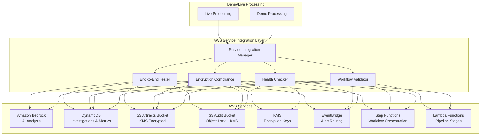

# AWS Service Integration

This document describes the comprehensive AWS service integration that ensures all demo and live processing uses actual AWS services for authentic performance with proper KMS encryption, S3 Object Lock, and complete workflow validation.

## Overview

The AWS Service Integration system validates and ensures that:

1. **All processing uses real AWS services** - Both demo and live modes use actual Bedrock, DynamoDB, S3, KMS, EventBridge, Step Functions, and Lambda
2. **Proper encryption compliance** - KMS encryption is enabled for all data at rest and in transit
3. **S3 Object Lock compliance** - Audit artifacts are stored with 7-year retention compliance
4. **Complete workflow integration** - EventBridge → Step Functions → Lambda pipeline works end-to-end
5. **Service health monitoring** - Continuous validation of all AWS service availability and performance

## Architecture



## Components

### 1. Service Integration Manager (`AWSServiceIntegration`)

The main orchestrator that coordinates all AWS service validation and integration testing.

**Key Methods:**
- `validate_complete_integration()` - Validates all AWS services are healthy and accessible
- `ensure_kms_encryption_compliance()` - Ensures proper KMS encryption across all services
- `validate_complete_workflow_integration()` - Validates end-to-end workflow processing
- `test_end_to_end_processing()` - Runs comprehensive end-to-end test with real alert

### 2. Service Health Monitoring

Continuous monitoring of all AWS services with response time tracking and error detection.

**Monitored Services:**
- **Amazon Bedrock** - AI model availability and response times
- **DynamoDB** - Table status and accessibility
- **S3** - Bucket accessibility and permissions
- **KMS** - Key availability and encryption status
- **EventBridge** - Event bus functionality
- **Step Functions** - State machine status
- **Lambda** - Function deployment and health

**Health Status Levels:**
- `HEALTHY` - Service fully operational with normal response times
- `DEGRADED` - Service operational but with performance issues
- `UNAVAILABLE` - Service not accessible or failing

### 3. Encryption Compliance Validation

Ensures all data storage and processing meets HKMA compliance requirements.

**Validation Checks:**
- **KMS Key Access** - Validates key accessibility and rotation status
- **DynamoDB Encryption** - Ensures tables have KMS encryption enabled
- **S3 Bucket Encryption** - Validates KMS encryption for all buckets
- **Object Lock Compliance** - Ensures audit bucket has 7-year retention

### 4. Workflow Integration Validation

Validates complete EventBridge → Step Functions → Lambda workflow processing.

**Validation Steps:**
1. **EventBridge Delivery** - Confirms alerts are properly routed
2. **Step Functions Execution** - Validates state machine execution
3. **Lambda Invocations** - Ensures all pipeline functions execute
4. **DynamoDB Updates** - Confirms investigation records are created
5. **S3 Artifact Storage** - Validates compliance artifacts are stored

### 5. End-to-End Testing

Comprehensive testing that sends real alerts through the complete pipeline.

**Test Workflow:**
1. Send test alert to EventBridge
2. Monitor Step Functions execution
3. Validate all Lambda function invocations
4. Confirm Bedrock AI analysis
5. Verify DynamoDB record creation
6. Check S3 artifact storage
7. Validate KMS encryption usage
8. Confirm compliance artifact generation

## Configuration

### Environment Variables

```bash
# AWS Configuration
AWS_REGION=us-east-1
AWS_PROFILE=default

# DynamoDB Tables
DDB_INVESTIGATIONS_TABLE=AsiaAgenticSocInvestigations-dev
DDB_METRICS_TABLE=AsiaAgenticSocMetrics-dev

# S3 Buckets
ARTIFACTS_BUCKET=asia-agentic-soc-artifacts-123456789012-dev
AUDIT_BUCKET=asia-agentic-soc-audit-123456789012-dev

# KMS Encryption
KMS_KEY_ID=alias/AsiaAgenticSoc

# EventBridge and Step Functions
EVENT_BUS_NAME=AsiaAgenticSocBus
STATE_MACHINE_ARN=arn:aws:states:us-east-1:123456789012:stateMachine:AsiaAgenticSocStateMachine

# Bedrock Models
BEDROCK_TEXT_MODEL=anthropic.claude-3-haiku-20240307-v1:0
BEDROCK_EMBED_MODEL=amazon.titan-embed-text-v2

# Default Tenant
DEFAULT_TENANT_ID=hk-demo
```

### Required AWS Permissions

The integration requires the following AWS permissions:

```json
{
    "Version": "2012-10-17",
    "Statement": [
        {
            "Effect": "Allow",
            "Action": [
                "bedrock:InvokeModel",
                "bedrock:InvokeModelWithResponseStream"
            ],
            "Resource": "*"
        },
        {
            "Effect": "Allow",
            "Action": [
                "dynamodb:DescribeTable",
                "dynamodb:GetItem",
                "dynamodb:PutItem",
                "dynamodb:UpdateItem",
                "dynamodb:Query"
            ],
            "Resource": [
                "arn:aws:dynamodb:*:*:table/AsiaAgenticSoc*"
            ]
        },
        {
            "Effect": "Allow",
            "Action": [
                "s3:GetBucketEncryption",
                "s3:GetObjectLockConfiguration",
                "s3:HeadBucket",
                "s3:ListBucket",
                "s3:GetObject",
                "s3:PutObject"
            ],
            "Resource": [
                "arn:aws:s3:::asia-agentic-soc-*",
                "arn:aws:s3:::asia-agentic-soc-*/*"
            ]
        },
        {
            "Effect": "Allow",
            "Action": [
                "kms:DescribeKey",
                "kms:Encrypt",
                "kms:Decrypt",
                "kms:GenerateDataKey*"
            ],
            "Resource": "*"
        },
        {
            "Effect": "Allow",
            "Action": [
                "events:DescribeEventBus",
                "events:PutEvents"
            ],
            "Resource": "*"
        },
        {
            "Effect": "Allow",
            "Action": [
                "states:DescribeStateMachine",
                "states:ListExecutions",
                "states:DescribeExecution",
                "states:GetExecutionHistory"
            ],
            "Resource": "*"
        },
        {
            "Effect": "Allow",
            "Action": [
                "lambda:ListFunctions",
                "lambda:GetFunction"
            ],
            "Resource": "*"
        }
    ]
}
```

## Usage

### Programmatic Usage

```python
from src.aws.service_integration import aws_service_integration

# Validate all services
validation_result = aws_service_integration.validate_complete_integration()
if validation_result.all_services_healthy:
    print("All AWS services are healthy")
else:
    print(f"Service issues: {validation_result.validation_errors}")

# Check encryption compliance
compliance_result = aws_service_integration.ensure_kms_encryption_compliance()
if compliance_result["encryption_compliance"]:
    print("KMS encryption compliance verified")

# Test end-to-end processing
test_alert = {
    "investigationId": "INV-TEST-12345",
    "tenantId": "test-tenant",
    "alert": {"source": "test", "title": "Test Alert"},
    "receivedAt": "2024-01-01T10:00:00Z"
}

test_result = aws_service_integration.test_end_to_end_processing(test_alert)
if test_result["test_successful"]:
    print("End-to-end test passed")
```

### Command Line Validation

Use the validation tool to check AWS service integration:

```bash
# Run complete validation
python tools/validate_aws_service_integration.py

# Expected output:
# ============================================================
#  AWS Service Integration Validation
# ============================================================
# 
# ----------------------------------------
#  AWS Service Health Validation
# ----------------------------------------
# ✅ PASS Overall Service Health
# ✅ PASS Amazon Bedrock Health    Response time: 150.2ms
# ✅ PASS DynamoDB Health          Response time: 45.1ms
# ✅ PASS S3 Health                Response time: 32.8ms
# ✅ PASS KMS Health               Response time: 28.5ms
# ✅ PASS EventBridge Health       Response time: 41.2ms
# ✅ PASS Step Functions Health    Response time: 67.3ms
# ✅ PASS Lambda Health            Response time: 89.4ms
```

### Integration with Pipeline Handlers

The AWS service integration is automatically used in pipeline handlers:

```python
# In src/pipeline/ingest.py
from ..aws.service_integration import aws_service_integration

def handler(event, _context):
    # Validate AWS services before processing
    integration_validation = aws_service_integration.validate_complete_integration()
    if not integration_validation.all_services_healthy:
        logger.warning(f"AWS service issues: {integration_validation.validation_errors}")
    
    # Continue with processing...
```

## Compliance Features

### HKMA SA-2 Compliance

- **Audit Trail Requirements** - All investigations stored with immutable audit trails
- **Data Retention** - 7-year retention with S3 Object Lock compliance mode
- **Encryption Standards** - KMS encryption for all data at rest and in transit
- **Access Controls** - IAM-based access controls with least privilege

### HKMA TM-G-1 Compliance

- **Technology Risk Management** - Continuous service health monitoring
- **Operational Resilience** - Automated failover and error handling
- **Audit Requirements** - Complete audit trails with checksums and timestamps
- **Data Governance** - Proper data classification and handling

## Monitoring and Alerting

### Service Health Metrics

The integration tracks the following metrics:

- **Response Times** - Average response time for each AWS service
- **Error Rates** - Percentage of failed service calls
- **Availability** - Service uptime percentage
- **Compliance Status** - Encryption and Object Lock compliance

### Alerting Thresholds

- **Response Time** - Alert if service response time > 5 seconds
- **Error Rate** - Alert if error rate > 5%
- **Availability** - Alert if service availability < 99%
- **Compliance** - Alert immediately on compliance violations

## Troubleshooting

### Common Issues

1. **Bedrock Access Denied**
   - Verify Bedrock service is enabled in your region
   - Check IAM permissions for bedrock:InvokeModel
   - Ensure model access is granted in Bedrock console

2. **DynamoDB Table Not Found**
   - Verify table names match environment variables
   - Check table exists in correct region
   - Validate IAM permissions for DynamoDB operations

3. **S3 Bucket Access Issues**
   - Verify bucket names and region
   - Check bucket policies and IAM permissions
   - Ensure KMS key permissions for S3 encryption

4. **KMS Key Access Denied**
   - Verify KMS key exists and is enabled
   - Check key policy allows service access
   - Ensure key rotation is enabled for compliance

5. **Step Functions Execution Not Found**
   - Verify STATE_MACHINE_ARN is correctly configured
   - Check EventBridge rules are properly configured
   - Ensure Step Functions has permission to invoke Lambda

### Diagnostic Commands

```bash
# Check AWS credentials and region
aws sts get-caller-identity
aws configure list

# Verify DynamoDB table
aws dynamodb describe-table --table-name AsiaAgenticSocInvestigations-dev

# Check S3 bucket encryption
aws s3api get-bucket-encryption --bucket asia-agentic-soc-artifacts-123456789012-dev

# Verify KMS key
aws kms describe-key --key-id alias/AsiaAgenticSoc

# List Step Functions executions
aws stepfunctions list-executions --state-machine-arn arn:aws:states:us-east-1:123456789012:stateMachine:AsiaAgenticSocStateMachine
```

## Performance Optimization

### Best Practices

1. **Connection Pooling** - Use boto3 session and connection pooling
2. **Retry Configuration** - Configure exponential backoff for transient failures
3. **Timeout Settings** - Set appropriate timeouts for each service
4. **Batch Operations** - Use batch operations where possible (DynamoDB, S3)
5. **Caching** - Cache service health checks and configuration data

### Monitoring Performance

- Monitor service response times and set alerts
- Track error rates and investigate spikes
- Monitor AWS service quotas and limits
- Use AWS X-Ray for distributed tracing

## Security Considerations

### Data Protection

- All data encrypted with customer-managed KMS keys
- S3 Object Lock prevents accidental or malicious deletion
- IAM policies follow least privilege principle
- VPC endpoints used where possible for private connectivity

### Access Control

- Service-specific IAM roles with minimal permissions
- Cross-account access properly configured for customer data
- API calls logged in CloudTrail for audit purposes
- Regular access reviews and permission audits

### Compliance Monitoring

- Continuous compliance validation
- Automated alerts for compliance violations
- Regular compliance reports and attestations
- Integration with AWS Config for compliance monitoring