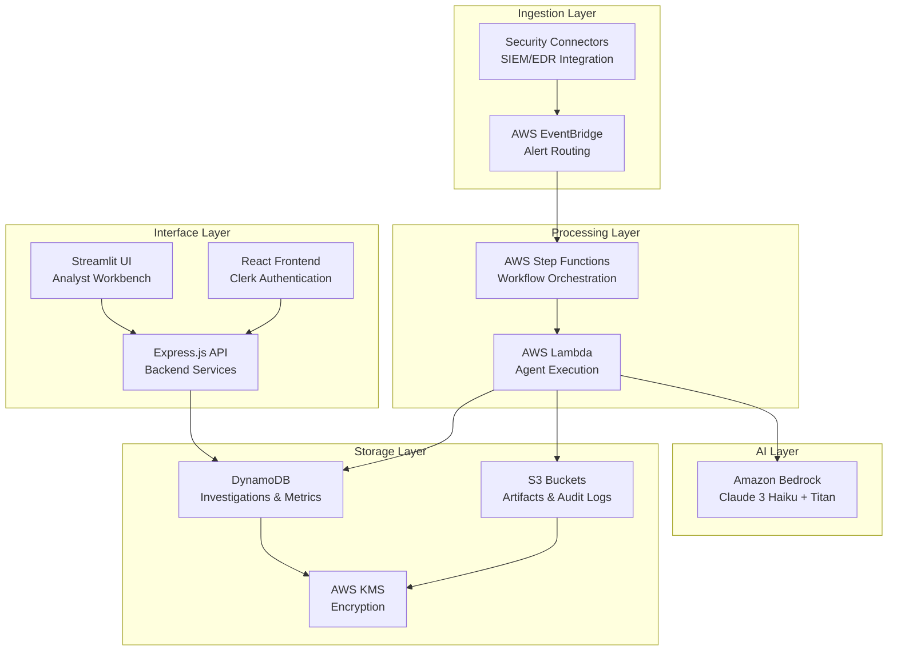
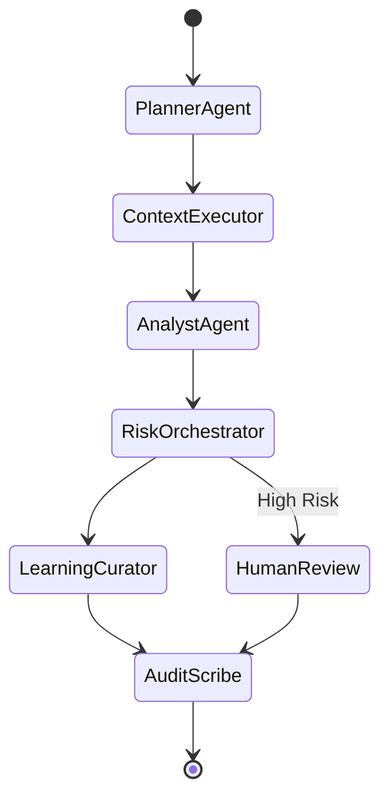
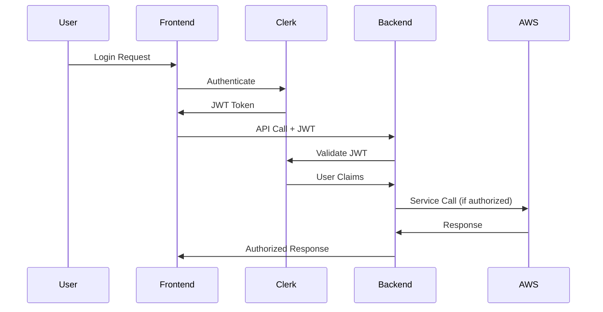

# NeoHarbour Security - Technical Documentation

## Table of Contents
1. [System Architecture Overview](#system-architecture-overview)
2. [Multi-Agent Pipeline](#multi-agent-pipeline)
3. [AWS Service Integration](#aws-service-integration)
4. [Authentication and Authorization](#authentication-and-authorization)
5. [Data Models and Storage](#data-models-and-storage)
6. [API Reference](#api-reference)
7. [Integration Points](#integration-points)
8. [Security Implementation](#security-implementation)
9. [Performance and Scalability](#performance-and-scalability)
10. [Monitoring and Observability](#monitoring-and-observability)
11. [Deployment Architecture](#deployment-architecture)
12. [Development Guidelines](#development-guidelines)

## System Architecture Overview

NeoHarbour Security implements a serverless, event-driven architecture on AWS that orchestrates multiple AI agents to automatically investigate security alerts. The system achieves 80%+ automation rates while maintaining comprehensive audit trails and HKMA compliance.

### High-Level Architecture



### Core Design Principles

1. **Serverless-First**: Minimize operational overhead with managed services
2. **Event-Driven**: Asynchronous processing with EventBridge orchestration
3. **Immutable Audit**: Complete investigation trails with S3 Object Lock
4. **AI-Powered**: Amazon Bedrock for intelligent analysis and decision making
5. **Compliance-Ready**: Built-in HKMA SA-2 and TM-G-1 mapping
## 
Multi-Agent Pipeline

The investigation pipeline consists of six specialized agents orchestrated by AWS Step Functions:

### Agent Architecture



### Agent Specifications

#### 1. Planner Agent (`src/pipeline/ingest.py`)
**Purpose**: Normalize and persist incoming alerts
**Responsibilities**:
- Alert validation and sanitization
- Data normalization across different source formats
- Initial investigation record creation
- Tenant isolation and routing

**Implementation**:
```python
def lambda_handler(event, context):
    """
    Planner Agent Lambda handler
    Normalizes alerts and creates investigation records
    """
    alert_data = event['alert']
    tenant_id = event.get('tenant_id', DEFAULT_TENANT_ID)
    
    # Normalize alert format
    normalized_alert = normalize_alert(alert_data)
    
    # Create investigation record
    investigation = create_investigation(normalized_alert, tenant_id)
    
    # Store in DynamoDB
    store_investigation(investigation)
    
    return {
        'investigation_id': investigation['investigation_id'],
        'normalized_alert': normalized_alert,
        'tenant_id': tenant_id
    }
```

#### 2. Context Executor (`src/pipeline/context.py`)
**Purpose**: Gather enrichment data from external sources
**Responsibilities**:
- SIEM/EDR data collection
- Threat intelligence lookup
- Historical context gathering
- Asset and user information enrichment

**Key Features**:
- Rate-limited API calls to prevent service disruption
- Caching mechanism for frequently accessed data
- Fallback handling for unavailable services
- Parallel data collection for performance

#### 3. Analyst Agent (`src/pipeline/summarize.py`)
**Purpose**: AI-powered analysis and threat assessment
**Responsibilities**:
- Amazon Bedrock integration for AI analysis
- Confidence score calculation
- False positive probability assessment
- Threat categorization and severity scoring

**AI Integration**:
```python
def analyze_with_bedrock(investigation_context):
    """
    Use Amazon Bedrock for AI-powered analysis
    """
    bedrock_client = boto3.client('bedrock-runtime')
    
    prompt = build_analysis_prompt(investigation_context)
    
    response = bedrock_client.invoke_model(
        modelId='anthropic.claude-3-haiku-20240307-v1:0',
        body=json.dumps({
            'prompt': prompt,
            'max_tokens': 4000,
            'temperature': 0.1
        })
    )
    
    analysis = parse_bedrock_response(response)
    return analysis
```###
# 4. Risk Orchestrator (`src/pipeline/risk.py`)
**Purpose**: Decision logic and escalation management
**Responsibilities**:
- Automation vs. escalation decisions
- Risk threshold evaluation
- Human-in-the-loop routing
- Compliance requirement checking

**Decision Logic**:
```python
def make_escalation_decision(analysis_result):
    """
    Determine if investigation should be escalated
    """
    confidence = analysis_result['confidence_score']
    risk_level = analysis_result['risk_level']
    
    # Auto-close if high confidence false positive
    if confidence >= 0.8 and risk_level == 'low':
        return {
            'decision': 'auto_close',
            'reason': 'High confidence false positive'
        }
    
    # Escalate if suspicious or high risk
    if confidence < 0.7 or risk_level in ['high', 'critical']:
        return {
            'decision': 'escalate',
            'reason': 'Requires human review'
        }
    
    # Default to monitoring for medium confidence
    return {
        'decision': 'monitor',
        'reason': 'Medium confidence - continue monitoring'
    }
```

#### 5. Learning Curator (`src/pipeline/adapt.py`)
**Purpose**: Feedback capture and system improvement
**Responsibilities**:
- Human feedback collection
- Model performance tracking
- Decision accuracy measurement
- Continuous learning data preparation

#### 6. Audit Scribe (`src/pipeline/audit.py`)
**Purpose**: Compliance artifacts and audit trail generation
**Responsibilities**:
- HKMA compliance report generation
- Immutable audit log creation
- Investigation summary documentation
- S3 Object Lock storage

## AWS Service Integration

### EventBridge Configuration
```yaml
EventBridge Rules:
  - Name: SecurityAlertIngestion
    EventPattern:
      source: ["neoharbour.security"]
      detail-type: ["Security Alert"]
    Targets:
      - Arn: !GetAtt InvestigationStateMachine.Arn
        RoleArn: !GetAtt EventBridgeRole.Arn
```

### Step Functions State Machine
```json
{
  "Comment": "NeoHarbour Security Investigation Pipeline",
  "StartAt": "PlannerAgent",
  "States": {
    "PlannerAgent": {
      "Type": "Task",
      "Resource": "arn:aws:lambda:region:account:function:planner-agent",
      "Next": "ContextExecutor"
    },
    "ContextExecutor": {
      "Type": "Task",
      "Resource": "arn:aws:lambda:region:account:function:context-executor",
      "Next": "AnalystAgent"
    },
    "AnalystAgent": {
      "Type": "Task",
      "Resource": "arn:aws:lambda:region:account:function:analyst-agent",
      "Next": "RiskOrchestrator"
    },
    "RiskOrchestrator": {
      "Type": "Choice",
      "Choices": [
        {
          "Variable": "$.decision",
          "StringEquals": "escalate",
          "Next": "HumanReview"
        }
      ],
      "Default": "LearningCurator"
    },
    "HumanReview": {
      "Type": "Task",
      "Resource": "arn:aws:states:::lambda:invoke.waitForTaskToken",
      "Parameters": {
        "FunctionName": "human-review-handler",
        "Payload": {
          "investigation.$": "$",
          "taskToken.$": "$$.Task.Token"
        }
      },
      "Next": "LearningCurator"
    },
    "LearningCurator": {
      "Type": "Task",
      "Resource": "arn:aws:lambda:region:account:function:learning-curator",
      "Next": "AuditScribe"
    },
    "AuditScribe": {
      "Type": "Task",
      "Resource": "arn:aws:lambda:region:account:function:audit-scribe",
      "End": true
    }
  }
}
```

### DynamoDB Table Schemas

#### Investigations Table
```python
{
    'investigation_id': 'string',  # Partition Key
    'tenant_id': 'string',
    'alert_source': 'string',
    'alert_type': 'string',
    'stage': 'string',  # planner|context|analyst|risk|learning|audit
    'status': 'string',  # active|completed|escalated|closed
    'confidence_score': 'number',
    'risk_level': 'string',
    'automation_decision': 'string',
    'created_at': 'string',
    'updated_at': 'string',
    'investigation_data': 'map',  # Full investigation context
    'compliance_mapping': 'map'   # HKMA control mappings
}
```

#### Metrics Table
```python
{
    'metric_id': 'string',  # Partition Key
    'tenant_id': 'string',
    'metric_type': 'string',  # automation_rate|processing_time|roi
    'timestamp': 'string',
    'value': 'number',
    'metadata': 'map'
}
```### 
S3 Bucket Structure
```
neoharbour-artifacts-bucket/
├── investigations/
│   ├── {tenant_id}/
│   │   ├── {investigation_id}/
│   │   │   ├── analysis_report.json
│   │   │   ├── compliance_report.pdf
│   │   │   └── evidence_files/
├── compliance/
│   ├── hkma_sa2/
│   └── hkma_tm_g1/
└── templates/

neoharbour-audit-bucket/  # Object Lock enabled
├── audit_logs/
│   ├── {year}/{month}/{day}/
│   │   ├── investigation_audit_{timestamp}.json
│   │   └── decision_audit_{timestamp}.json
└── immutable_records/
    ├── {tenant_id}/
    │   └── {investigation_id}_complete.json
```

## Authentication and Authorization

### Clerk Integration Architecture


### Role-Based Access Control (RBAC)
```typescript
interface UserRole {
  role_name: 'admin' | 'analyst' | 'demo_user' | 'viewer';
  permissions: Permission[];
  aws_access_level: 'full' | 'read_only' | 'demo_only';
}

interface Permission {
  resource: string;  // investigations|users|config|demo
  actions: string[]; // create|read|update|delete
  conditions?: {
    tenant_id?: string;
    investigation_status?: string;
  };
}
```

### JWT Token Validation
```javascript
// Backend JWT validation middleware
const validateJWT = async (req, res, next) => {
  const token = req.headers.authorization?.split(' ')[1];
  
  try {
    const decoded = await clerkClient.verifyToken(token);
    req.user = {
      id: decoded.sub,
      email: decoded.email,
      role: decoded.publicMetadata.role,
      permissions: decoded.publicMetadata.permissions
    };
    next();
  } catch (error) {
    res.status(401).json({ error: 'Invalid token' });
  }
};
```

## Data Models and Storage

### Investigation Data Model
```python
@dataclass
class Investigation:
    investigation_id: str
    tenant_id: str
    alert_source: str
    alert_type: str
    stage: InvestigationStage
    status: InvestigationStatus
    confidence_score: float
    risk_level: RiskLevel
    automation_decision: AutomationDecision
    created_at: datetime
    updated_at: datetime
    investigation_data: Dict[str, Any]
    compliance_mapping: Dict[str, Any]
    
    # Demo-specific fields
    is_demo: bool = False
    demo_session_id: Optional[str] = None
    false_positive_probability: Optional[float] = None
```

### Demo Session Model
```python
@dataclass
class DemoSession:
    session_id: str
    created_at: datetime
    created_by: str
    scenario_types: List[str]
    parameters: DemoParameters
    status: DemoStatus
    metrics: DemoMetrics

@dataclass
class DemoParameters:
    interval_seconds: float
    false_positive_rate: float
    complexity_level: ComplexityLevel
    target_audience: AudienceType
    duration_minutes: Optional[int]
```

### Compliance Mapping Model
```python
@dataclass
class ComplianceMapping:
    investigation_id: str
    hkma_sa2_controls: List[str]  # e.g., ['SA2.1.1', 'SA2.2.3']
    hkma_tm_g1_requirements: List[str]  # e.g., ['TM-G-1.2.1']
    evidence_artifacts: List[str]  # S3 object keys
    audit_trail_complete: bool
    compliance_score: float
```

## API Reference

### Investigation Management API

#### Get Investigation
```http
GET /api/investigations/{investigation_id}
Authorization: Bearer {jwt_token}

Response:
{
  "investigation_id": "inv_123456",
  "tenant_id": "tenant_001",
  "status": "completed",
  "confidence_score": 0.85,
  "automation_decision": "auto_close",
  "created_at": "2024-01-15T10:30:00Z",
  "investigation_data": { ... },
  "compliance_mapping": { ... }
}
```

#### List Investigations
```http
GET /api/investigations?tenant_id={tenant}&status={status}&limit={limit}
Authorization: Bearer {jwt_token}

Response:
{
  "investigations": [...],
  "pagination": {
    "next_token": "token_123",
    "has_more": true
  }
}
```

### Demo System API

#### Start Demo Session
```http
POST /api/demo/sessions
Authorization: Bearer {jwt_token}
Content-Type: application/json

{
  "scenario_types": ["phishing", "ransomware"],
  "parameters": {
    "interval_seconds": 30,
    "false_positive_rate": 0.8,
    "complexity_level": "intermediate",
    "duration_minutes": 15
  }
}

Response:
{
  "session_id": "demo_789",
  "status": "active",
  "created_at": "2024-01-15T10:30:00Z"
}
```

#### Get Demo Metrics
```http
GET /api/demo/sessions/{session_id}/metrics
Authorization: Bearer {jwt_token}

Response:
{
  "session_id": "demo_789",
  "alerts_processed": 47,
  "auto_closed": 38,
  "escalated": 9,
  "automation_rate": 0.81,
  "avg_processing_time": 23.5,
  "time_saved_hours": 2.3,
  "roi_value": 1247.50
}
```### User 
Management API

#### Create User
```http
POST /api/users
Authorization: Bearer {jwt_token}
Content-Type: application/json

{
  "email": "analyst@company.com",
  "role": "analyst",
  "permissions": ["investigations:read", "investigations:update"],
  "aws_access_level": "read_only"
}

Response:
{
  "user_id": "user_456",
  "clerk_id": "clerk_789",
  "status": "invitation_sent"
}
```

#### Update User Role
```http
PUT /api/users/{user_id}/role
Authorization: Bearer {jwt_token}
Content-Type: application/json

{
  "role": "admin",
  "permissions": ["*"]
}
```

### System Health API

#### System Status
```http
GET /api/health/system
Authorization: Bearer {jwt_token}

Response:
{
  "status": "healthy",
  "services": {
    "dynamodb": "connected",
    "s3": "connected",
    "bedrock": "connected",
    "eventbridge": "connected"
  },
  "metrics": {
    "active_investigations": 12,
    "avg_processing_time": 45.2,
    "automation_rate": 0.83
  }
}
```

## Integration Points

### SIEM/EDR Connectors

#### Microsoft Sentinel Integration
```python
class SentinelConnector:
    def __init__(self, workspace_id, tenant_id, client_id, client_secret):
        self.workspace_id = workspace_id
        self.auth_client = self._setup_auth(tenant_id, client_id, client_secret)
    
    def get_security_alerts(self, time_range='24h'):
        """Fetch security alerts from Sentinel"""
        query = f"""
        SecurityAlert
        | where TimeGenerated >= ago({time_range})
        | project TimeGenerated, AlertName, AlertSeverity, Entities
        """
        return self._execute_kql_query(query)
    
    def get_incident_details(self, incident_id):
        """Get detailed incident information"""
        endpoint = f"/subscriptions/{self.subscription_id}/resourceGroups/{self.resource_group}/providers/Microsoft.OperationalInsights/workspaces/{self.workspace_id}/providers/Microsoft.SecurityInsights/incidents/{incident_id}"
        return self._make_api_call(endpoint)
```

#### Splunk Integration
```python
class SplunkConnector:
    def __init__(self, host, port, username, password):
        self.client = splunklib.client.connect(
            host=host, port=port, username=username, password=password
        )
    
    def search_events(self, search_query, earliest_time='-24h'):
        """Execute Splunk search and return results"""
        job = self.client.jobs.create(
            search_query,
            earliest_time=earliest_time,
            latest_time='now'
        )
        
        # Wait for job completion
        while not job.is_done():
            time.sleep(1)
        
        return [result for result in job.results()]
```

### Customer AWS Data Sources

#### CloudTrail Integration
```python
class CloudTrailConnector:
    def __init__(self, bucket_name, prefix, role_arn=None):
        self.bucket_name = bucket_name
        self.prefix = prefix
        self.s3_client = self._setup_s3_client(role_arn)
    
    def get_recent_events(self, hours=24):
        """Fetch recent CloudTrail events"""
        start_time = datetime.utcnow() - timedelta(hours=hours)
        
        # List objects in S3 bucket
        objects = self.s3_client.list_objects_v2(
            Bucket=self.bucket_name,
            Prefix=self.prefix,
            StartAfter=self._get_s3_key_for_time(start_time)
        )
        
        events = []
        for obj in objects.get('Contents', []):
            # Download and parse CloudTrail log file
            log_data = self._download_and_decompress(obj['Key'])
            events.extend(self._parse_cloudtrail_records(log_data))
        
        return events
```

#### GuardDuty Integration
```python
class GuardDutyConnector:
    def __init__(self, detector_id, region, role_arn=None):
        self.detector_id = detector_id
        self.guardduty_client = self._setup_guardduty_client(region, role_arn)
    
    def get_findings(self, severity_filter='MEDIUM'):
        """Fetch GuardDuty findings"""
        response = self.guardduty_client.list_findings(
            DetectorId=self.detector_id,
            FindingCriteria={
                'Criterion': {
                    'severity': {
                        'Gte': self._severity_to_number(severity_filter)
                    }
                }
            }
        )
        
        finding_ids = response['FindingIds']
        
        # Get detailed finding information
        findings_response = self.guardduty_client.get_findings(
            DetectorId=self.detector_id,
            FindingIds=finding_ids
        )
        
        return findings_response['Findings']
```

## Security Implementation

### Encryption at Rest
All data is encrypted using AWS KMS with customer-managed keys:

```yaml
KMS Key Policy:
  Version: '2012-10-17'
  Statement:
    - Sid: Enable IAM User Permissions
      Effect: Allow
      Principal:
        AWS: !Sub 'arn:aws:iam::${AWS::AccountId}:root'
      Action: 'kms:*'
      Resource: '*'
    - Sid: Allow NeoHarbour Services
      Effect: Allow
      Principal:
        Service:
          - dynamodb.amazonaws.com
          - s3.amazonaws.com
          - lambda.amazonaws.com
      Action:
        - kms:Decrypt
        - kms:GenerateDataKey
      Resource: '*'
```

### Encryption in Transit
- All API communications use TLS 1.3
- Internal AWS service communication encrypted by default
- Clerk authentication uses secure JWT tokens
- Database connections use SSL/TLS

### Access Control Implementation
```python
def check_permission(user, resource, action, context=None):
    """
    Check if user has permission for specific action on resource
    """
    user_permissions = get_user_permissions(user.role)
    
    for permission in user_permissions:
        if permission.resource == resource or permission.resource == '*':
            if action in permission.actions or '*' in permission.actions:
                # Check conditions if specified
                if permission.conditions:
                    if not evaluate_conditions(permission.conditions, context):
                        continue
                return True
    
    return False
```

### Audit Logging
```python
def log_audit_event(event_type, user_id, resource, action, result, metadata=None):
    """
    Log audit event to immutable S3 storage
    """
    audit_record = {
        'timestamp': datetime.utcnow().isoformat(),
        'event_type': event_type,
        'user_id': user_id,
        'resource': resource,
        'action': action,
        'result': result,
        'metadata': metadata or {},
        'source_ip': get_client_ip(),
        'user_agent': get_user_agent()
    }
    
    # Store in S3 with Object Lock
    s3_key = f"audit_logs/{datetime.utcnow().strftime('%Y/%m/%d')}/audit_{uuid.uuid4()}.json"
    
    s3_client.put_object(
        Bucket=AUDIT_BUCKET,
        Key=s3_key,
        Body=json.dumps(audit_record),
        ServerSideEncryption='aws:kms',
        SSEKMSKeyId=KMS_KEY_ID,
        ObjectLockMode='COMPLIANCE',
        ObjectLockRetainUntilDate=datetime.utcnow() + timedelta(days=2555)  # 7 years
    )
```## Pe
rformance and Scalability

### Scalability Architecture
The system is designed to handle varying loads through AWS managed services:

#### Auto-Scaling Components
- **Lambda Functions**: Automatic concurrency scaling up to 1000 concurrent executions
- **DynamoDB**: On-demand billing mode with automatic scaling
- **Step Functions**: Handles up to 25,000 concurrent executions
- **EventBridge**: Processes millions of events per second

#### Performance Optimization
```python
# Lambda function optimization
def optimized_lambda_handler(event, context):
    # Connection pooling for database connections
    if not hasattr(optimized_lambda_handler, 'db_connection'):
        optimized_lambda_handler.db_connection = create_db_connection()
    
    # Caching for frequently accessed data
    cache_key = f"investigation_{event['investigation_id']}"
    cached_data = redis_client.get(cache_key)
    
    if cached_data:
        return json.loads(cached_data)
    
    # Process investigation
    result = process_investigation(event)
    
    # Cache result for 5 minutes
    redis_client.setex(cache_key, 300, json.dumps(result))
    
    return result
```

#### Batch Processing
```python
def batch_process_alerts(alerts):
    """
    Process multiple alerts in batches for efficiency
    """
    batch_size = 25  # DynamoDB batch write limit
    
    for i in range(0, len(alerts), batch_size):
        batch = alerts[i:i + batch_size]
        
        # Batch write to DynamoDB
        with dynamodb_table.batch_writer() as batch_writer:
            for alert in batch:
                batch_writer.put_item(Item=alert)
        
        # Batch invoke Step Functions
        step_functions_client.start_execution_batch(
            stateMachineArn=STATE_MACHINE_ARN,
            executions=[
                {
                    'name': f"investigation_{alert['id']}",
                    'input': json.dumps(alert)
                }
                for alert in batch
            ]
        )
```

### Performance Monitoring
```python
# CloudWatch custom metrics
def publish_performance_metrics(investigation_id, processing_time, stage):
    """
    Publish custom metrics to CloudWatch
    """
    cloudwatch_client.put_metric_data(
        Namespace='NeoHarbour/Performance',
        MetricData=[
            {
                'MetricName': 'ProcessingTime',
                'Dimensions': [
                    {'Name': 'Stage', 'Value': stage},
                    {'Name': 'InvestigationId', 'Value': investigation_id}
                ],
                'Value': processing_time,
                'Unit': 'Seconds',
                'Timestamp': datetime.utcnow()
            }
        ]
    )
```

## Monitoring and Observability

### CloudWatch Integration
```yaml
CloudWatch Alarms:
  - AlarmName: HighInvestigationProcessingTime
    MetricName: ProcessingTime
    Namespace: NeoHarbour/Performance
    Statistic: Average
    Period: 300
    EvaluationPeriods: 2
    Threshold: 120  # seconds
    ComparisonOperator: GreaterThanThreshold
    
  - AlarmName: LowAutomationRate
    MetricName: AutomationRate
    Namespace: NeoHarbour/Metrics
    Statistic: Average
    Period: 900
    EvaluationPeriods: 3
    Threshold: 0.75  # 75%
    ComparisonOperator: LessThanThreshold
```

### Distributed Tracing
```python
import boto3
from aws_xray_sdk.core import xray_recorder
from aws_xray_sdk.core import patch_all

# Patch AWS SDK calls for X-Ray tracing
patch_all()

@xray_recorder.capture('investigation_processing')
def process_investigation(investigation_data):
    """
    Process investigation with X-Ray tracing
    """
    investigation_id = investigation_data['investigation_id']
    
    # Add metadata to trace
    xray_recorder.put_metadata('investigation_id', investigation_id)
    xray_recorder.put_metadata('tenant_id', investigation_data['tenant_id'])
    
    # Create subsegment for AI analysis
    with xray_recorder.in_subsegment('ai_analysis'):
        analysis_result = analyze_with_bedrock(investigation_data)
        xray_recorder.put_metadata('confidence_score', analysis_result['confidence'])
    
    return analysis_result
```

### Health Check Implementation
```python
def comprehensive_health_check():
    """
    Perform comprehensive system health check
    """
    health_status = {
        'status': 'healthy',
        'timestamp': datetime.utcnow().isoformat(),
        'services': {},
        'metrics': {}
    }
    
    # Check DynamoDB
    try:
        dynamodb_table.describe_table()
        health_status['services']['dynamodb'] = 'healthy'
    except Exception as e:
        health_status['services']['dynamodb'] = f'unhealthy: {str(e)}'
        health_status['status'] = 'degraded'
    
    # Check S3
    try:
        s3_client.head_bucket(Bucket=ARTIFACTS_BUCKET)
        health_status['services']['s3'] = 'healthy'
    except Exception as e:
        health_status['services']['s3'] = f'unhealthy: {str(e)}'
        health_status['status'] = 'degraded'
    
    # Check Bedrock
    try:
        bedrock_client.list_foundation_models()
        health_status['services']['bedrock'] = 'healthy'
    except Exception as e:
        health_status['services']['bedrock'] = f'unhealthy: {str(e)}'
        health_status['status'] = 'degraded'
    
    # Get performance metrics
    health_status['metrics'] = get_current_metrics()
    
    return health_status
```

## Deployment Architecture

### Infrastructure as Code (SAM Template)
```yaml
AWSTemplateFormatVersion: '2010-09-09'
Transform: AWS::Serverless-2016-10-31

Parameters:
  Environment:
    Type: String
    Default: dev
    AllowedValues: [dev, staging, prod]
  
  TenantId:
    Type: String
    Default: default

Resources:
  # DynamoDB Tables
  InvestigationsTable:
    Type: AWS::DynamoDB::Table
    Properties:
      TableName: !Sub 'AsiaAgenticSoc-Investigations-${Environment}'
      BillingMode: PAY_PER_REQUEST
      AttributeDefinitions:
        - AttributeName: investigation_id
          AttributeType: S
      KeySchema:
        - AttributeName: investigation_id
          KeyType: HASH
      PointInTimeRecoverySpecification:
        PointInTimeRecoveryEnabled: true
      SSESpecification:
        SSEEnabled: true
        KMSMasterKeyId: !Ref EncryptionKey

  # S3 Buckets
  ArtifactsBucket:
    Type: AWS::S3::Bucket
    Properties:
      BucketName: !Sub 'neoharbour-artifacts-${Environment}-${AWS::AccountId}'
      BucketEncryption:
        ServerSideEncryptionConfiguration:
          - ServerSideEncryptionByDefault:
              SSEAlgorithm: aws:kms
              KMSMasterKeyID: !Ref EncryptionKey
      PublicAccessBlockConfiguration:
        BlockPublicAcls: true
        BlockPublicPolicy: true
        IgnorePublicAcls: true
        RestrictPublicBuckets: true

  # Lambda Functions
  PlannerAgent:
    Type: AWS::Serverless::Function
    Properties:
      FunctionName: !Sub 'neoharbour-planner-${Environment}'
      CodeUri: src/pipeline/
      Handler: ingest.lambda_handler
      Runtime: python3.12
      Timeout: 60
      MemorySize: 512
      Environment:
        Variables:
          DDB_INVESTIGATIONS_TABLE: !Ref InvestigationsTable
          ARTIFACTS_BUCKET: !Ref ArtifactsBucket
          KMS_KEY_ID: !Ref EncryptionKey
      Policies:
        - DynamoDBCrudPolicy:
            TableName: !Ref InvestigationsTable
        - S3CrudPolicy:
            BucketName: !Ref ArtifactsBucket
        - KMSDecryptPolicy:
            KeyId: !Ref EncryptionKey
```

### Multi-Environment Configuration
```bash
# Development deployment
sam deploy --config-env dev --parameter-overrides Environment=dev

# Staging deployment
sam deploy --config-env staging --parameter-overrides Environment=staging

# Production deployment
sam deploy --config-env prod --parameter-overrides Environment=prod
```

### CI/CD Pipeline
```yaml
# .github/workflows/deploy.yml
name: Deploy NeoHarbour Security

on:
  push:
    branches: [main, develop]

jobs:
  test:
    runs-on: ubuntu-latest
    steps:
      - uses: actions/checkout@v3
      - name: Set up Python
        uses: actions/setup-python@v4
        with:
          python-version: '3.12'
      - name: Install dependencies
        run: |
          pip install -r requirements.txt
          pip install -r requirements-test.txt
      - name: Run tests
        run: pytest tests/ -v --cov=src/

  deploy-dev:
    needs: test
    if: github.ref == 'refs/heads/develop'
    runs-on: ubuntu-latest
    steps:
      - uses: actions/checkout@v3
      - name: Configure AWS credentials
        uses: aws-actions/configure-aws-credentials@v2
        with:
          aws-access-key-id: ${{ secrets.AWS_ACCESS_KEY_ID }}
          aws-secret-access-key: ${{ secrets.AWS_SECRET_ACCESS_KEY }}
          aws-region: ap-southeast-1
      - name: Deploy to dev
        run: |
          sam build
          sam deploy --config-env dev --no-confirm-changeset

  deploy-prod:
    needs: test
    if: github.ref == 'refs/heads/main'
    runs-on: ubuntu-latest
    steps:
      - uses: actions/checkout@v3
      - name: Configure AWS credentials
        uses: aws-actions/configure-aws-credentials@v2
        with:
          aws-access-key-id: ${{ secrets.AWS_ACCESS_KEY_ID_PROD }}
          aws-secret-access-key: ${{ secrets.AWS_SECRET_ACCESS_KEY_PROD }}
          aws-region: ap-southeast-1
      - name: Deploy to production
        run: |
          sam build
          sam deploy --config-env prod --no-confirm-changeset
```## Develo
pment Guidelines

### Code Organization
Follow the established project structure:

```
src/
├── agents/          # Multi-agent system components
├── ai/             # AI service abstractions
├── api/            # REST API endpoints
├── aws/            # AWS service integrations
├── compliance/     # HKMA compliance utilities
├── connectors/     # External system integrations
├── demo/           # Demo system components
├── knowledge/      # Knowledge base management
├── metrics/        # Metrics collection and analysis
├── monitoring/     # Health checks and diagnostics
├── pipeline/       # Investigation pipeline stages
├── remediation/    # Automated remediation actions
└── utils/          # Shared utilities
```

### Coding Standards

#### Python Code Style
```python
# Use type hints for all function signatures
def process_investigation(
    investigation_id: str,
    tenant_id: str,
    context: Dict[str, Any]
) -> InvestigationResult:
    """
    Process security investigation with AI analysis.
    
    Args:
        investigation_id: Unique investigation identifier
        tenant_id: Tenant identifier for multi-tenancy
        context: Investigation context and enrichment data
    
    Returns:
        InvestigationResult with analysis and recommendations
    
    Raises:
        InvestigationError: If processing fails
        ValidationError: If input data is invalid
    """
    # Implementation here
    pass

# Use dataclasses for structured data
@dataclass
class InvestigationResult:
    investigation_id: str
    confidence_score: float
    risk_level: RiskLevel
    automation_decision: AutomationDecision
    analysis_summary: str
    evidence_artifacts: List[str]
    compliance_mapping: Dict[str, List[str]]
```

#### Error Handling
```python
# Custom exception hierarchy
class NeoHarbourError(Exception):
    """Base exception for NeoHarbour Security"""
    pass

class InvestigationError(NeoHarbourError):
    """Investigation processing errors"""
    pass

class ValidationError(NeoHarbourError):
    """Data validation errors"""
    pass

class IntegrationError(NeoHarbourError):
    """External system integration errors"""
    pass

# Error handling with proper logging
import logging
logger = logging.getLogger(__name__)

def safe_api_call(func, *args, **kwargs):
    """
    Safely execute API call with retry logic and error handling
    """
    max_retries = 3
    retry_delay = 1
    
    for attempt in range(max_retries):
        try:
            return func(*args, **kwargs)
        except (ConnectionError, TimeoutError) as e:
            if attempt == max_retries - 1:
                logger.error(f"API call failed after {max_retries} attempts: {e}")
                raise IntegrationError(f"Failed to connect to external service: {e}")
            
            logger.warning(f"API call attempt {attempt + 1} failed, retrying in {retry_delay}s: {e}")
            time.sleep(retry_delay)
            retry_delay *= 2  # Exponential backoff
```

#### Testing Guidelines
```python
# Unit test structure
import pytest
from unittest.mock import Mock, patch
from src.pipeline.ingest import lambda_handler

class TestPlannerAgent:
    """Test suite for Planner Agent functionality"""
    
    @pytest.fixture
    def sample_alert(self):
        """Sample alert data for testing"""
        return {
            'alert_id': 'alert_123',
            'source': 'sentinel',
            'type': 'phishing',
            'severity': 'medium',
            'timestamp': '2024-01-15T10:30:00Z',
            'raw_data': {...}
        }
    
    @pytest.fixture
    def mock_dynamodb(self):
        """Mock DynamoDB table for testing"""
        with patch('boto3.resource') as mock_resource:
            mock_table = Mock()
            mock_resource.return_value.Table.return_value = mock_table
            yield mock_table
    
    def test_alert_normalization(self, sample_alert):
        """Test alert data normalization"""
        normalized = normalize_alert(sample_alert)
        
        assert normalized['investigation_id'].startswith('inv_')
        assert normalized['tenant_id'] == 'default'
        assert normalized['alert_type'] == 'phishing'
        assert 'created_at' in normalized
    
    @patch('src.pipeline.ingest.store_investigation')
    def test_lambda_handler_success(self, mock_store, sample_alert, mock_dynamodb):
        """Test successful lambda handler execution"""
        event = {'alert': sample_alert}
        context = Mock()
        
        result = lambda_handler(event, context)
        
        assert 'investigation_id' in result
        assert result['tenant_id'] == 'default'
        mock_store.assert_called_once()

# Integration test structure
class TestInvestigationPipeline:
    """Integration tests for complete investigation pipeline"""
    
    @pytest.mark.integration
    def test_end_to_end_investigation(self, real_aws_resources):
        """Test complete investigation from alert to audit"""
        # This test uses real AWS resources in test environment
        alert_data = create_test_alert()
        
        # Trigger investigation
        investigation_id = trigger_investigation(alert_data)
        
        # Wait for completion
        result = wait_for_investigation_completion(investigation_id, timeout=60)
        
        # Verify results
        assert result['status'] == 'completed'
        assert result['confidence_score'] > 0
        assert 'compliance_mapping' in result
        
        # Verify audit trail
        audit_records = get_audit_records(investigation_id)
        assert len(audit_records) >= 6  # One for each agent
```

### Configuration Management
```python
# Environment-specific configuration
import os
from dataclasses import dataclass
from typing import Optional

@dataclass
class Config:
    """Application configuration"""
    # AWS Configuration
    aws_region: str = os.getenv('AWS_REGION', 'ap-southeast-1')
    dynamodb_investigations_table: str = os.getenv('DDB_INVESTIGATIONS_TABLE')
    dynamodb_metrics_table: str = os.getenv('DDB_METRICS_TABLE')
    artifacts_bucket: str = os.getenv('ARTIFACTS_BUCKET')
    audit_bucket: str = os.getenv('AUDIT_BUCKET')
    kms_key_id: str = os.getenv('KMS_KEY_ID')
    
    # AI Configuration
    ai_provider: str = os.getenv('AI_PROVIDER', 'bedrock')
    bedrock_model_id: str = os.getenv('BEDROCK_MODEL_ID', 'anthropic.claude-3-haiku-20240307-v1:0')
    bedrock_embedding_model: str = os.getenv('BEDROCK_EMBEDDING_MODEL', 'amazon.titan-embed-text-v1')
    
    # Demo Configuration
    demo_enabled: bool = os.getenv('DEMO_ENABLED', 'true').lower() == 'true'
    demo_default_interval: int = int(os.getenv('DEMO_DEFAULT_INTERVAL', '30'))
    demo_false_positive_rate: float = float(os.getenv('DEMO_FALSE_POSITIVE_RATE', '0.8'))
    
    # Security Configuration
    clerk_secret_key: str = os.getenv('CLERK_SECRET_KEY')
    jwt_secret: str = os.getenv('JWT_SECRET')
    
    def validate(self) -> None:
        """Validate required configuration"""
        required_fields = [
            'dynamodb_investigations_table',
            'artifacts_bucket',
            'clerk_secret_key'
        ]
        
        missing_fields = [
            field for field in required_fields
            if not getattr(self, field)
        ]
        
        if missing_fields:
            raise ValueError(f"Missing required configuration: {missing_fields}")

# Usage
config = Config()
config.validate()
```

### Documentation Standards
```python
def complex_function(
    param1: str,
    param2: Optional[Dict[str, Any]] = None,
    param3: bool = False
) -> Tuple[bool, str]:
    """
    Brief description of what the function does.
    
    Longer description if needed, explaining the purpose, algorithm,
    or any important implementation details.
    
    Args:
        param1: Description of first parameter
        param2: Description of second parameter, including default behavior
        param3: Description of boolean parameter
    
    Returns:
        Tuple containing:
        - bool: Success status
        - str: Result message or error description
    
    Raises:
        ValueError: If param1 is empty or invalid
        ConnectionError: If external service is unavailable
    
    Example:
        >>> success, message = complex_function("test_value", {"key": "value"})
        >>> print(f"Success: {success}, Message: {message}")
        Success: True, Message: Operation completed
    
    Note:
        This function requires AWS credentials to be configured.
        Performance may vary based on network conditions.
    """
    # Implementation here
    pass
```

### Performance Best Practices
```python
# Efficient DynamoDB operations
def batch_get_investigations(investigation_ids: List[str]) -> List[Dict[str, Any]]:
    """
    Efficiently retrieve multiple investigations using batch operations
    """
    # Use batch_get_item for multiple records
    dynamodb = boto3.resource('dynamodb')
    table = dynamodb.Table(INVESTIGATIONS_TABLE)
    
    # DynamoDB batch_get_item limit is 100 items
    batch_size = 100
    all_investigations = []
    
    for i in range(0, len(investigation_ids), batch_size):
        batch_ids = investigation_ids[i:i + batch_size]
        
        response = dynamodb.batch_get_item(
            RequestItems={
                INVESTIGATIONS_TABLE: {
                    'Keys': [{'investigation_id': id} for id in batch_ids]
                }
            }
        )
        
        all_investigations.extend(response['Responses'][INVESTIGATIONS_TABLE])
    
    return all_investigations

# Connection pooling for external APIs
import requests
from requests.adapters import HTTPAdapter
from urllib3.util.retry import Retry

class APIClient:
    """HTTP client with connection pooling and retry logic"""
    
    def __init__(self, base_url: str, timeout: int = 30):
        self.base_url = base_url
        self.session = requests.Session()
        
        # Configure retry strategy
        retry_strategy = Retry(
            total=3,
            backoff_factor=1,
            status_forcelist=[429, 500, 502, 503, 504]
        )
        
        # Configure connection pooling
        adapter = HTTPAdapter(
            pool_connections=10,
            pool_maxsize=20,
            max_retries=retry_strategy
        )
        
        self.session.mount("http://", adapter)
        self.session.mount("https://", adapter)
        self.session.timeout = timeout
```

---

## Appendix

### Glossary
- **Investigation**: A security alert processing workflow through the multi-agent pipeline
- **Tenant**: Isolated customer environment with dedicated data and configuration
- **Agent**: Specialized component handling specific investigation tasks
- **Automation Decision**: AI-driven determination to auto-close or escalate an investigation
- **Compliance Mapping**: Association of investigation activities with HKMA regulatory controls

### Reference Links
- [AWS SAM Documentation](https://docs.aws.amazon.com/serverless-application-model/)
- [Amazon Bedrock API Reference](https://docs.aws.amazon.com/bedrock/latest/APIReference/)
- [Clerk Authentication Documentation](https://clerk.com/docs)
- [HKMA SA-2 Guidelines](https://www.hkma.gov.hk/eng/key-functions/banking-stability/supervisory-policy-manual/)

### Support Contacts
- **Technical Support**: support@neoharbour.security
- **Emergency Escalation**: +852-XXXX-XXXX
- **Documentation Updates**: docs@neoharbour.security